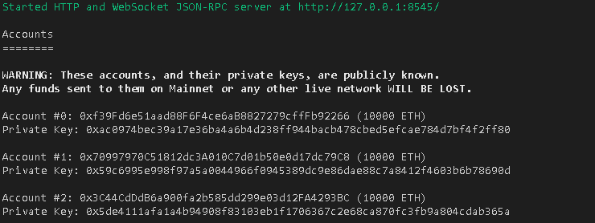
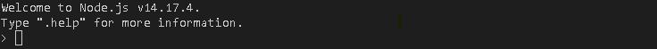
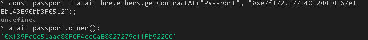
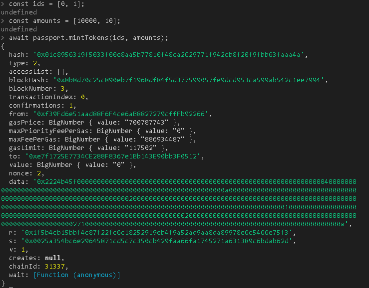
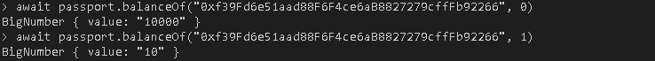

# MVerse - MvP Development

<!-- ## Sample Hardhat Project

This project demonstrates a basic Hardhat use case. It comes with a sample contract, a test for that contract, and a script that deploys that contract.

Try running some of the following tasks:

```shell
npx hardhat help
npx hardhat test
GAS_REPORT=true npx hardhat test
npx hardhat node
npx hardhat run scripts/deploy.js
``` -->

## Running Contracts on a local Hardhat Node

Running a Hardhat node:

```sh
npx hardhat node
```

You must see something like this (with different account addresses from 1 to 19):


_By default, `"0xf39Fd6e51aad88F6F4ce6aB8827279cffFb92266"` will be the owner address that it will use if we not specify another address to run the commands on Hardhat console_

## Deploying contracts

Deploy project in localhost network:

```sh
npx hardhat run --network localhost scripts/deploy.js
```

You must see something like this (with a different address):


_The address `"0xe7f1725E7734CE288F8367e1Bb143E90bb3F0512"` is the contract address that was deployed in localhost network_

## Running commands in console

Execute the console in localhost network:

```sh
npx hardhat console --network localhost
```

You must see this:


## Check contract Owner

Execute the following commands in console:

```sh
const passport = await hre.ethers.getContractAt("Passport", "0xe7f1725E7734CE288F8367e1Bb143E90bb3F0512");

await passport.owner()
```

_In the first command above, you need to replace `"0xe7f1725E7734CE288F8367e1Bb143E90bb3F0512"` with your Passport contract address shown in the **"Deploying contracts"** step_

You must see this:


_Note that the address of the owner that will appear must be the Account #0 shown in the screenshot of section **"Running Contracts on a local Hardhat Node"**_

## Mint Tokens with address owner

Execute the following commands in console:

```sh
const ids = [0, 1];

const amounts = [10000, 10];

await passport.mintTokens(ids, amounts);
```

**Note that the array `ids` and `amounts` has two elements**

- The first element of array `ids` we specify the type of $MVerse Tokens, that is 0, and in the second we specify the type of Passport we want to mint, that is Member_Level_1 (with id 1)

- The first element of array `amounts` we specify the number of MVerse Tokens we want to mint, and in the second element we specify the amount of Passport of Member-Level-1 we want to mint.

You must see this:


## Check balances of tokens in the owner address

Execute the following commands in console:

`"0xf39Fd6e51aad88F6F4ce6aB8827279cffFb92266"` will be the owner address that we will use here, you need to replace this with the Account #0 address shown in "Running Contracts on a local Hardhat Node" step

```sh
await passport.balanceOf("0xf39Fd6e51aad88F6F4ce6aB8827279cffFb92266", 0)

await passport.balanceOf("0xf39Fd6e51aad88F6F4ce6aB8827279cffFb92266", 1)
```

You must see this:


_Note that when we specify the second parameter of balanceOf as 0, it showed us `value: "10000"` and when we specify as 1 it showed us `value: "10"`, this is exactly the values we entered in the "Mint Tokens" step_
