# MVerse - Passport Marketplace

<!-- ## Sample Hardhat Project

This project demonstrates a basic Hardhat use case. It comes with a sample contract, a test for that contract, and a script that deploys that contract.

Try running some of the following tasks:

```shell
npx hardhat help
npx hardhat test
GAS_REPORT=true npx hardhat test
npx hardhat node
npx hardhat run scripts/deploy.js
``` -->

## Running Contracts on a local Hardhat Node

Running a Hardhat node:

```sh
npx hardhat node
```

You must see something like this (with different account addresses from 1 to 19):


_By default, `"0xf39Fd6e51aad88F6F4ce6aB8827279cffFb92266"` will be the owner address that it will use if we not specify another address to run the commands on Hardhat console_

## Deploying contracts

Deploy project in localhost network:

```sh
npx hardhat run --network localhost scripts/deploy.js
```

You must see something like this (with a different address):


_The address `"0xe7f1725E7734CE288F8367e1Bb143E90bb3F0512"` is the contract address that was deployed in localhost network_

## Running commands in console

Execute the console in localhost network:

```sh
npx hardhat console --network localhost
```

You must see this:


## Check contract Owner address

Execute the following commands in console:

```sh
const passport = await hre.ethers.getContractAt("Passport", "0xe7f1725E7734CE288F8367e1Bb143E90bb3F0512");

await passport.owner()
```

_In the first command above, you need to replace `"0xe7f1725E7734CE288F8367e1Bb143E90bb3F0512"` with your Passport contract address shown in the **"Deploying contracts"** step_.

You must see this:


_Note that the address of the owner that will appear must be the Account #0 shown in the screenshot of section **"Running Contracts on a local Hardhat Node".**_

## Mint Tokens with Owner address

Execute the following commands in console:

```sh
const ids = [0, 1];

const amounts = [10000, 10];

await passport.mintTokens(ids, amounts);
```

**Note that the array `ids` and `amounts` must have two elements**

- The first element of array `ids` we specify the type of `$MVerse Tokens`, that is 0, and in the second we specify the type of Passport we want to mint, that is `Member_Level_1` (with id 1)

- The first element of array `amounts` we specify the number of `$MVerse Tokens` we want to mint, and in the second element we specify the amount of Passports of `Member-Level-1` we want to mint.

_Note that by executing these commands as the contract owner, you can mint how many passports you want._

You must see this:


## Check balances of tokens in the owner address

Execute the following commands in console:

`"0xf39Fd6e51aad88F6F4ce6aB8827279cffFb92266"` will be the owner address that we will use here, you need to replace this with the Account #0 address shown in **"Running Contracts on a local Hardhat Node"** step.

```sh
await passport.balanceOf("0xf39Fd6e51aad88F6F4ce6aB8827279cffFb92266", 0)

await passport.balanceOf("0xf39Fd6e51aad88F6F4ce6aB8827279cffFb92266", 1)
```

You must see this:


_Note that when we specify the second parameter of balanceOf as 0, it showed us `value: "10000"` and when we specify as 1 it showed us `value: "10"`, this is exactly the values we entered in the **"Mint Tokens"** step._

## Check balance of tokens Minted with Address

After mint the Passport and $MVerse Token in the step above, you can check them by executing the following commands in console (passing through it the address of owner):

```sh
await passport.balanceOfTokens("0xf39Fd6e51aad88F6F4ce6aB8827279cffFb92266");
```

**The portion with yellow color refers to Ids, and the one in red refers to amounts. Both described in the Mint Tokens step.**

You must see this:
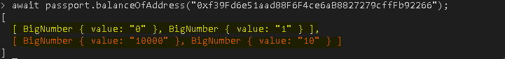

## Check balance of tokens Minted with Address with a specific array Ids

After mint the Passport and $MVerse Token in the step above, you can check them by executing the following commands in console (passing through it the address of owner and the Ids of tokens):

```sh
const ids = [0, 1];

await passport.balanceOfTokens("0xf39Fd6e51aad88F6F4ce6aB8827279cffFb92266", ids);
```

**Note that the array `_ids` must have two elements and they must follow the description above in the step of Mint Tokens with Owner address.**

You must see this:
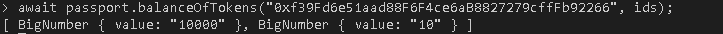

## Burn Tokens with Owner address

After mint the Passport and $MVerse Token in the step above, you can burn them too by executing the following commands in console:

```sh
const _ids = [0, 1];

const _amounts = [10000, 10];

await passport.burnTokens(_ids, _amounts);
```

**Note that the array `_ids` and `_amounts` must have two elements and they are described above in the step of Mint Tokens with Owner address.**

_Note that by executing these commands as the contract owner, you can burn how many passports/tokens you want._

You must see this:
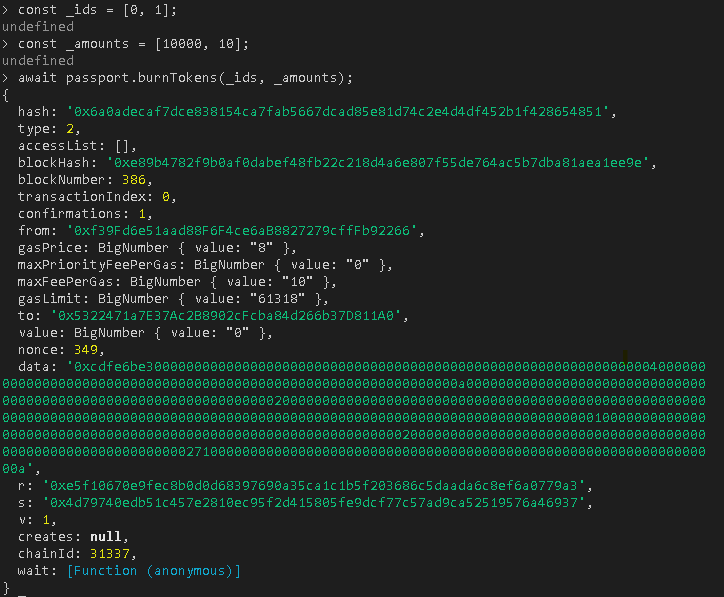

## Creating a signer

Get the Account #1 address `0x70997970C51812dc3A010C7d01b50e0d17dc79C8` in the **Running Contracts on a local Hardhat Node** step, and execute the following command:

```sh
const signer = passport.provider.getSigner("0x70997970C51812dc3A010C7d01b50e0d17dc79C8");
```

You must see this:
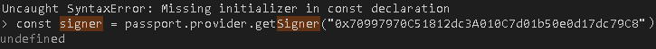

## Using Contract with a Signer

Get the contract address again from **Deploying a Contract** step, in this case `0x70997970C51812dc3A010C7d01b50e0d17dc79C8`, and execute the following command:

```sh
const passport_signer = await hre.ethers.getContractAt("Passport", "0xe7f1725E7734CE288F8367e1Bb143E90bb3F0512", signer);
```

You must see this:
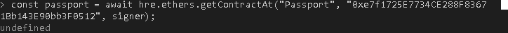

## Mint Tokens with the signer address

Defining new valueus for array `ids_2` and `amounts_2`:

- using [0, 3] to ids, with number 3 representing Member_Level_3
- and [1000, 1] to ammounts, representing 1000 $MVerse Tokens and only one passport Member*Level3. \_Note that we cannot set more than 1 in the second element because the address of signer is not the owner of our contract Passport deployed in the **Deploying contract** step*

```sh
const ids_2 = [0, 3];

const amounts_2 = [1000, 1];

await passport_signer.connect(signer).mintTokens(ids_2, amounts_2, { value: ethers.utils.parseEther("1.0") });
```

You must see this:
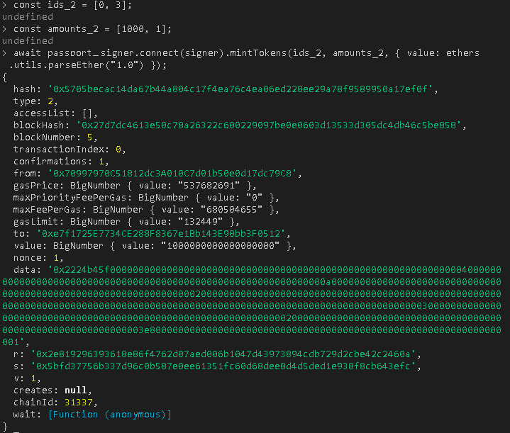

## Check balances of tokens in our signer address

Execute the following commands in console:

```sh
await passport.balanceOf(signer._address, 1)

await passport.balanceOf(signer._address, 0)
```

You must see this:
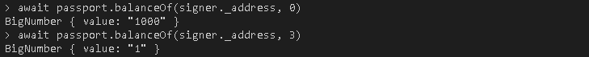

_Note that when we specify the second parameter of balanceOf as 0, it showed us `value: "1000"` and when we specify as 3 it showed us `value: "1"`, this is exactly the values we entered in the **"Mint Tokens with the signer address"** step._

## Run tests

Execute the following command:

```sh
npx hardhat test --network localhost
```

You must see this:
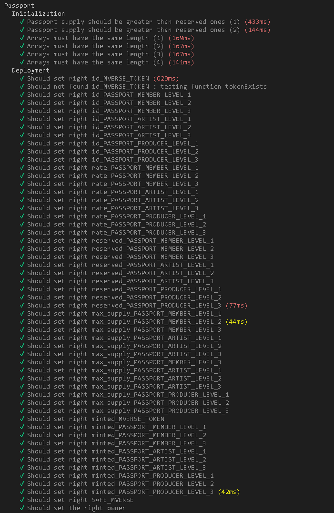

# Only Owner Functions

## setRate/getRate of Passports

To change the Rate of Passport you need to execute the following command:

```sh
await passport.setRate(1, ethers.utils.parseEther('0.999'))
```

In this case, the first parameter must be the Id of Passport, and the second the new rate.

You can check the if the change was made by executing the following command:

```sh
await passport.getRate(1)
```

You must see this:
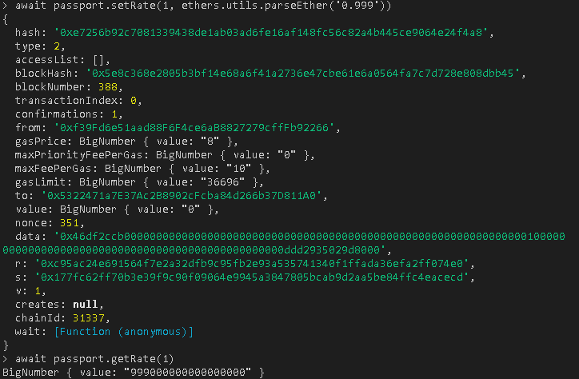

## setReserved/getReserved: change the Reserved number of Passports to Owner (Manager)

To change the Rate of Passport you need to execute the following command:

```sh
await passport.setReserved(1, ethers.utils.parseEther('0.999'))
```

In this case, the first parameter must be the Id of Passport, and the second the new rate.

You can check the if the change was made by executing the following command:

```sh
await passport.getReserved(1)
```

You must see this:
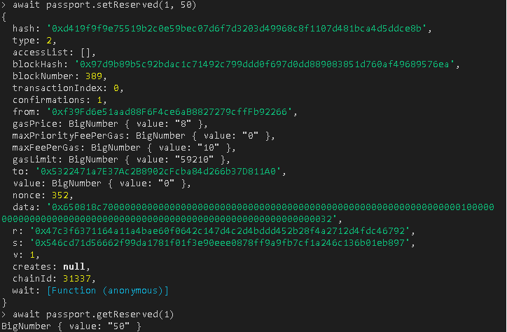

## setMaxSupply/getMaxSupply: change the Max Supply of Passports or $MVerse Tokens (Manager)

To change the Max Supply of Passport you need to execute the following command:

```sh
await passport.setMaxSupply(1, 500)
```

In this case, the first parameter must be the Id of Passport, and the second the new rate.

You can check the if the change was made by executing the following command:

```sh
await passport.getMaxSupply(1)
```

You must see this:
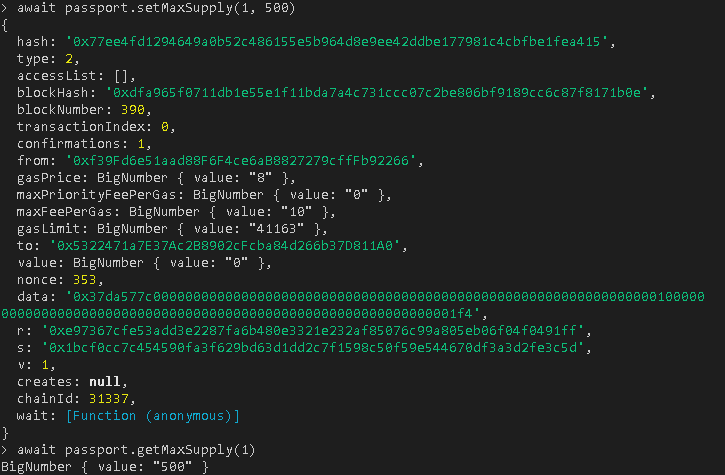
